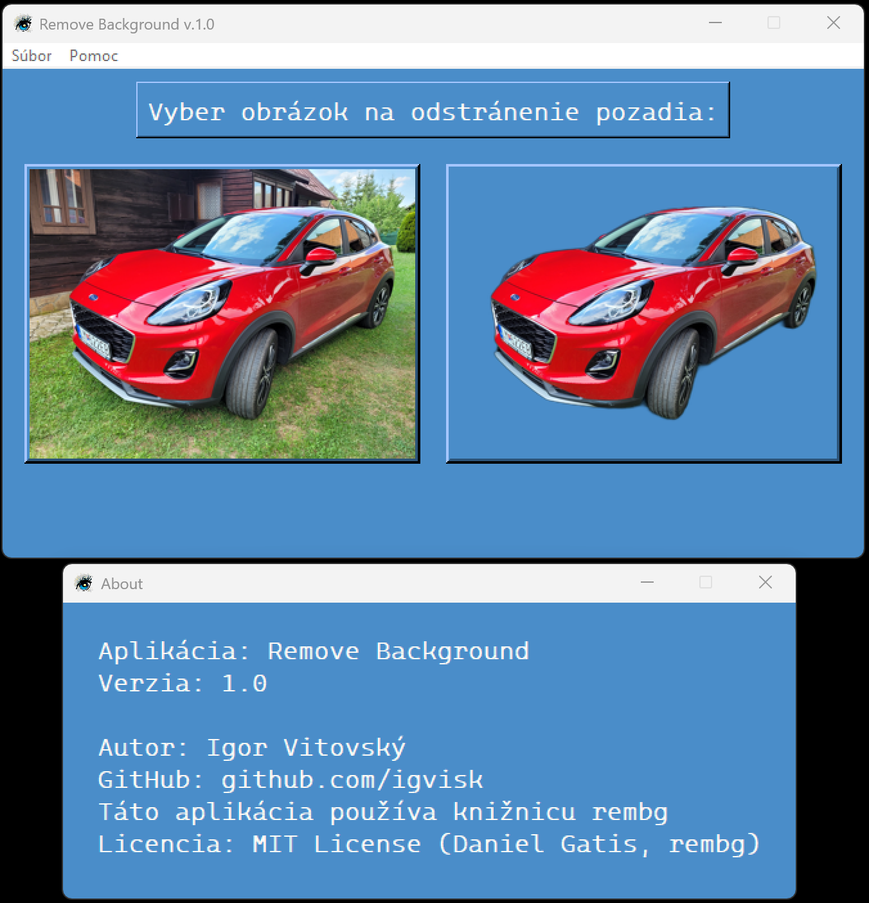

[](LICENSE) 

# Remove Background App

A simple desktop application (Tkinter GUI) for removing image backgrounds using the [rembg](https://github.com/danielgatis/rembg) library and the **U²Net ONNX model**.  
The app provides a preview of the original and processed image, and saves the output locally.

---

## ✨ Features
- Background removal powered by **rembg** and **onnxruntime** (CPU/GPU with CUDA if available).
- GUI built with **Tkinter**.
- Image preview before and after processing.
- Offline support: the ONNX model (`u2net.onnx`) is cached locally and can be bundled with the app.
- Menu shortcuts:
  - **Ctrl+N** → Open image
  - **Ctrl+O** → Open output folder
  - **Ctrl+Q** → Quit app
  - **F1** → About window
- Hover effect on buttons for better user experience.

---


## 🖼️ Preview
  
[]


## 📦 Installation

1. Clone the repository:
   ```bash
   git clone https://github.com/igvisk/remove-background-app.git
   cd remove-background-app

   - Install dependencies:
pip install rembg pillow
- Note: rembg automatically installs onnxruntime.
For GPU acceleration, install onnxruntime-gpu.
- Ensure the U²Net model is available:
- By default, rembg downloads u2net.onnx into a cache folder (~/.u2net/).
- This app overrides the cache location with a local models/ folder:
  models/u2net.onnx

▶️ UsageRun the app:python app.py
Steps:- Click "Select image to remove background".
- Preview the original image.
- The processed image (background removed) will be shown and saved into the output/ folder.
- Use Ctrl+O to open the output folder.
📂 Project Structureremove-background-app/
│
├── app.py              # Main application
├── models/             # Contains u2net.onnx model
├── output/             # Processed images are saved here
└── Remove-Background.ico  # Application icon


⚡ Notes- Works offline once the ONNX model is downloaded.
- Tested on Windows; Linux/Mac supported with minor adjustments (folder opening uses xdg-open).
- License: MIT (Daniel Gatis, rembg).
👤 Author- Igor Vitovský
- GitHub: igvisk

