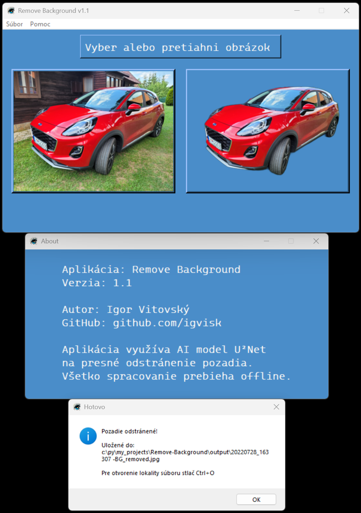

[](LICENSE) 

# Remove Background App

A simple desktop application (Tkinter GUI) for removing image backgrounds using the [rembg](https://github.com/danielgatis/rembg) library and the **U²Net ONNX model**.  
The app provides a preview of the original and processed image, supports drag & drop, and saves the output locally.

---

## 📥 Download (Windows)

👉 **Precompiled Windows executable** is available on the Releases page:  
https://github.com/igvisk/Remove-Background/releases

**How to run:**
1. Download the ZIP file from Releases
2. Extract it
3. Run `Remove-Background.exe`

⚠️ *Windows SmartScreen may show a warning because the app is not digitally signed.*

---

## ✨ Features
- Background removal powered by **rembg** and **onnxruntime** (CPU/GPU with CUDA if available).
- GUI built with **Tkinter**.
- **Drag & Drop support** — simply drop an image file into the app window.
- Image preview before and after processing.
- Offline support: the ONNX model (`u2net.onnx`) is cached locally and can be bundled with the app.
- Keyboard shortcuts:
  - **Ctrl+N** → Open image
  - **Ctrl+O** → Open output folder
  - **Ctrl+Q** → Quit app
  - **F1** → About window
- Hover effect on buttons for better user experience.

---
## 🤖 AI Model

This application uses a deep learning model (**U²Net**) to perform background removal.  
U²Net is a convolutional neural network trained for image segmentation, capable of detecting the main subject in a photo with high accuracy.

- The model runs locally on your device using **ONNX Runtime**.
- No data is sent anywhere — processing is fully offline.
- The default model (`u2net.onnx`) provides high‑quality results.
- A lightweight alternative (`u2netp.onnx`) can be used for faster startup and lower memory usage.

### Why U²Net?
- High‑quality segmentation (excellent for people, animals, objects)
- Handles fine details such as hair and edges
- Works fully offline
- Stable and widely used in production tools

### Default model used by this app
The application uses the **full U²Net model (`u2net.onnx`)** by default:
- Size: ~176 MB  
- Best accuracy  
- Higher RAM usage (approx. 250–350 MB depending on system)

### Alternative models (optional)
Rembg also supports several other models:
- **U²Netp (`u2netp.onnx`)** – lightweight 4 MB version (faster, lower RAM, slightly lower quality)
- **U²Net‑Human** – optimized for human portraits
- **U²Net‑Cloth** – optimized for clothing segmentation
- **ISNet models** – newer, smaller models for general or anime‑style images

The app can be easily configured to use a different model by replacing the ONNX file in the `models/` folder.

---

## 🖼️ Preview
  


---

## 🛠️ Installation

1. Clone the repository:
   ```bash
   git clone https://github.com/igvisk/remove-background-app.git
   cd remove-background-app

   - Install dependencies:
pip install rembg pillow
- Note: rembg automatically installs onnxruntime.

For GPU acceleration, install onnxruntime-gpu.
- Ensure the U²Net model is available:
- By default, rembg downloads u2net.onnx into a cache folder (~/.u2net/).
- This app overrides the cache location with a local models/ folder:
  models/u2net.onnx

---

▶️ Usage (from source)
python Remove_Background.py

Steps:
- Click "Vyber alebo pretiahni obrázok".
- Preview the original image.
- The processed image (background removed) will be shown and saved into the output/ folder.
- Use Ctrl+O to open the output folder.
📂 Project Structureremove-background-app/
│
├── Remove_Background.py  # Main application
├── models/               # Contains u2net.onnx model
├── output/               # Processed images are saved here
├── images/               # README images
└── Remove-Background.ico # Application icon

---

⚡ Notes

Works fully offline after the model is available

Tested on Windows

Linux / macOS supported with minor adjustments
(folder opening uses xdg-open)

---

👤 Author

Igor Vitovský
GitHub: https://github.com/igvisk